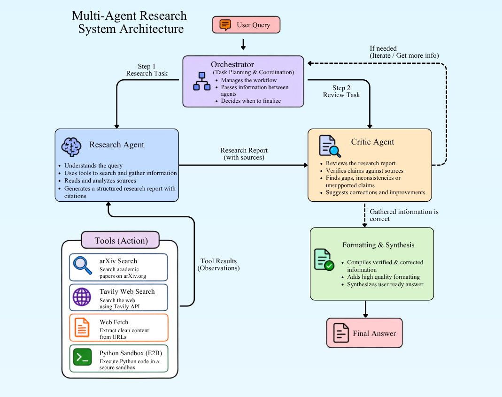

<div align="center">

# 🧠 Multi Agent Research System

**An autonomous research system where one agent researches, another audits, and neither ships until the work holds up.**

[](https://www.python.org/)
[](https://streamlit.io/)
[](https://www.langchain.com/langgraph)
[](https://openrouter.ai/)
[](LICENSE)


</div>

---

## 📖 Overview

**Multi Agent Research System** is an LLM-powered research system built around a simple idea: *a single agent grading its own homework isn't enough.*

Given a natural-language question, a **Research Agent** searches academic and web sources, reads the most relevant ones in full, runs computations on the data it finds, and drafts a cited markdown report. That draft is then handed to a separate **Critic Agent**, which audits it against the sources — checking for unsupported claims, untraceable statistics, and arguments that don't actually answer the prompt.

If the Critic rejects the draft, its feedback is fed straight back to the Researcher, which gets a fresh tool budget to fix the problems and try again. This will iterate until the Critic approves or a revision cap (to avoid latency) is reached. Only then does the report reach the user.

The result is a system that can revise its draft instead of immediately shipping its first attempt.

> Built as part of a walkthrough video by **YantraCode** — [watch it here](https://youtu.be/scR9HlavFiA)

---

## ✨ Features

- 🔬 **Researcher / Critic separation** — generation and verification are handled by distinct agents with distinct prompts, so the reviewer isn't biased by having written the draft
- 🔁 **Critique driven revision loop** — rejected drafts return to the Researcher with specific, numbered, actionable feedback
- 🎯 **Severity aware review** — the Critic blocks only on critical issues (contradicted claims, missing sources on major claims)
- 🚫 **No goalpost moving** — on revision rounds the Critic may only re-raise unresolved issues, never invent new nitpicks
- 🔍 **Multi source discovery** — searches [arXiv](https://arxiv.org/) for papers and [Tavily](https://tavily.com/) for general web/news context
- 📄 **Full-text reading** — fetches and cleans article/paper text via `trafilatura`, with token-aware truncation
- 🧮 **Sandboxed computation** — runs Python in an isolated [E2B](https://e2b.dev/) sandbox to compute stats, comparisons, or tables from extracted data
- 💰 **Tool-call budgeting** — per-tool and per-step limits prevent runaway loops, and budgets **reset on each revision** so the Researcher can actually act on feedback
- 🖥️ **Live agent trace UI** — every thinking step, tool call, tool result, and critic verdict streams into Streamlit in real time

---

## 🏗️ Architecture

<p align="center">
  
</p>

---

## 🛠️ Tech Stack

| Layer | Technology |
|---|---|
| LLM access | OpenAI SDK / OpenRouter |
| Agent orchestration | LangGraph |
| UI | Streamlit |
| Web search | Tavily API |
| Academic search | arXiv API |
| Web scraping | trafilatura |
| Code execution | E2B Code Interpreter (sandboxed) |
| Tokenization | tiktoken |

---

## 📁 Project Structure

```
.
├── tools/
│   ├── __init__.py          # Tool registry (AVAILABLE_TOOLS)
│   ├── arxiv_tool.py         # arXiv search tool
│   ├── search_tool.py        # Tavily web search tool
│   ├── web_fetch.py           # Article/page scraping + truncation
│   └── sandbox_tool.py        # E2B sandboxed Python execution
├── assets/
│   ├── Architecture.png         
│   ├── demo.gif
├── agent_critic.py             # Critic Agent: audits drafts, emits verdict + feedback
├── agent_research.py           # Research Agent: tool-calling draft generation 
├── app.py               
├── tools_langchain.py          # LangChain @tool wrappers around tools/
├── prompts.py                  # Shared system prompt + tool schema generation
├── config.py                   # Environment/config loading
├── orchestrator.py             # LangGraph StateGraph: nodes, routers, shared state
├── requirements.txt
├── .gitignore
├── LICENSE
├── .env.example
└── README.md
```

---

## 🚀 Getting Started

### Prerequisites
- Python 3.10+
- API keys for:
  - [OpenRouter](https://openrouter.ai/) (LLM access)
  - [Tavily](https://tavily.com/) (web search)
  - [E2B](https://e2b.dev/) (sandboxed code execution)

### Installation

```bash
# Clone the repository
git clone https://github.com/YantraCode-ai/Multi-Agent-Research-System.git
cd Multi-Agent-Research-System

# Create and activate a virtual environment
python -m venv venv
source venv/bin/activate      # Windows: venv\Scripts\activate

# Install dependencies
pip install -r requirements.txt
```

### Configuration

Create a `.env` file in the project root:

```env
OPENROUTER_API_KEY=your_openrouter_key_here
TAVILY_API_KEY=your_tavily_key_here
E2B_API_KEY=your_e2b_key_here
```

> The model used by default is configured in `config.py` via `MODEL_NAME` — update it to any model available on your account.

### Running the app

```bash
streamlit run app.py
```

Then open the local URL Streamlit prints (typically `http://localhost:8501`) and ask a research question, e.g.:

> *"Compare recent agentic RAG benchmarks and summarize which approach performs best."*

---

## 🧭 How the Agent Reasons

### The Research Agent

The research prompt (`prompts.py`) constrains the agent to move forward through four phases only:

1. **Discover** — run 2–3 targeted `arxiv_search` / `tavily_search` queries to shortlist candidate sources.
2. **Read** — fetch full text for only the 1–2 most relevant sources via `web_fetch`.
3. **Compute** *(optional)* — use `python_sandbox` to derive metrics or build comparison tables.
4. **Report** — produce a markdown draft with direct answers, attributed claims, and explicit caveats about limited or mixed evidence.

Tool budgets and step limits guarantee each research pass converges to a draft.

### The Critic Agent

The Critic evaluates every draft across five dimensions: accuracy, citations, data-claim traceability, data integrity, and clarity, and returns strict JSON:

```json
{
  "is_approved": false,
  "feedback": "1. The claim in line 2 that latency dropped 40% cites no source. Add the benchmark table or remove the figure.\n2. ..."
}

```

It rejects **only** on critical issues:

- a claim contradicted by the draft's own data
- a central statistic with no traceable source
- a missing citation on a major claim a reader would need to verify
- an argument that doesn't actually answer the prompt

Everything else: phrasing, formatting, minor imprecision, is returned as optional polish *alongside* an approval. This asymmetry is deliberate: a Critic that blocks on style is a Critic that never lets the loop finish.

The node also parses defensively. If the model returns malformed JSON, the failure defaults to **rejection**, never to silent approval, a parsing bug should never let an unverified draft through.

### Revision mechanics

| State key Purpose  |                                                                 |
| ------------------ | --------------------------------------------------------------- |
| `revision_count`   | Increments each critic pass; caps the outer loop                |
| `step_count`       | Reset to `0` on rejection so revisions start with a full budget |
| `tool_call_count`  | Reset to `0` on rejection for the same reason                   |

Resetting the budgets matters: without it, a Researcher that spent its allowance on the first draft would have nothing left to fix it with, and the loop would burn revisions producing identical output.

---

## 🤝 Contributing

Contributions are welcome! Please open an issue to discuss significant changes before submitting a pull request.

1. Fork the repository
2. Create a feature branch (`git checkout -b feature/my-feature`)
3. Commit your changes
4. Open a pull request

---

## 📄 License

Distributed under the MIT License. See [LICENSE](LICENSE) for details.

---

<div align="center">
Built and maintained by <a href="https://github.com/yantracode-ai">YantraCode</a>
<br>Authored By: Akshat Gupta
</div>
